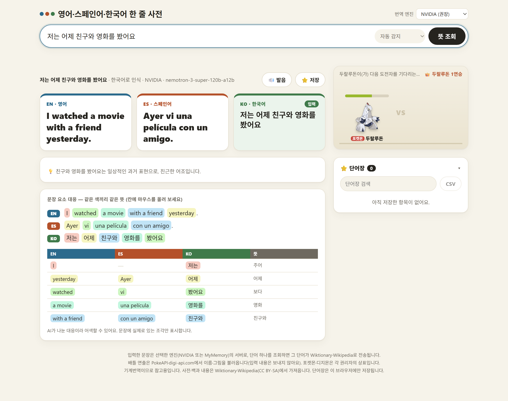
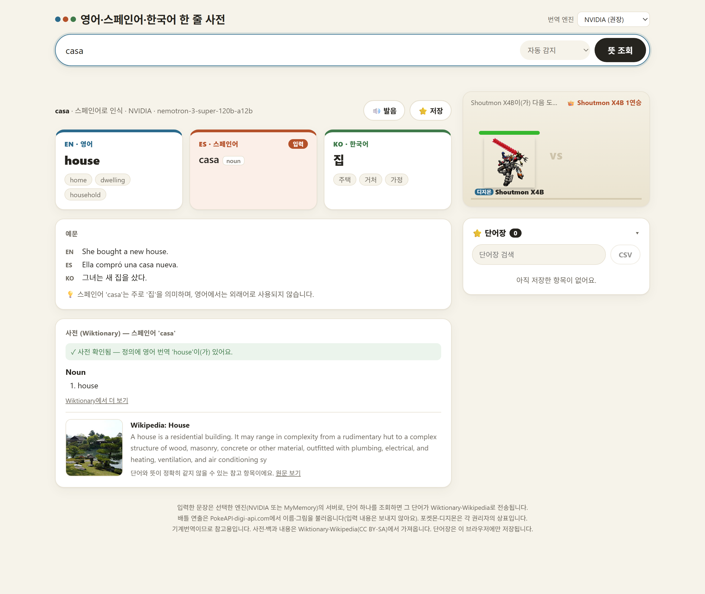

# 영어·스페인어·한국어 한 줄 사전

단어나 문장을 **한 번 입력**하면, 입력한 언어를 알아서 판별하고 **영어 · 스페인어 · 한국어 세 언어의 뜻을 한눈에** 보여주는 로컬 웹 도구입니다.
모르는 표현이 나올 때마다 사전·번역 앱을 번갈아 켜던 흐름을 끊지 않으려고 만들었습니다. (검색할 때마다 포켓몬·디지몬이 배틀하는 건 덤입니다.)



## 주요 기능

- **한 칸 입력, 세 언어 출력** — EN | ES | KO 카드가 항상 같은 순서로 나란히 나옵니다. 입력 언어는 자동 감지(직접 지정도 가능).
- **문장 요소 대응** — 문장을 의미 단위로 쪼개 세 언어를 **같은 색으로 짝지어** 보여줍니다. 어순이 다른 한국어(동사가 끝에 옴)도 뜻 기준으로 연결되고, 칸에 마우스를 올리면 세 문장에서 동시에 강조됩니다.
- **단어 모드: 사전 + 백과** — 단어 하나를 조회하면 Wiktionary 정의와 Wikipedia 요약·이미지를 함께 보여줍니다.
- **번역 교차 검증** — 모델이 낸 영어 번역이 Wiktionary 정의에 실제로 있는지 대조해 `✓ 사전 확인됨` / `⚠ 찾지 못함`을 표시합니다. (모델이 틀려도 알아챌 수 있게 하려는 장치)
- **단어장** — 저장, 검색, CSV 내보내기, 🔊 발음(브라우저 내장 TTS). 데이터는 내 브라우저에만 저장됩니다.
- **배틀 아레나** — 검색 1회마다 `등장 → 싸움 → 승부 → 퇴장`이 한 판씩 진행됩니다. 이긴 쪽은 남아서 연승을 쌓고, 진 쪽은 퇴장합니다. 번역을 기다리는 10~40초를 채워 줍니다.
- **주소로 바로 조회** — `http://localhost:8000/?q=agua` 처럼 열면 자동으로 조회합니다. (`&lang=en|es|ko`로 입력 언어 지정)
- 데스크톱 2열 / 모바일 1열 반응형, `prefers-reduced-motion` 지원.

<details>
<summary>단어 조회 화면 보기</summary>



</details>

## 빠른 시작

필요한 것: **Python 3** (3.11에서 개발·테스트했고, 외부 패키지는 없습니다) 과 [NVIDIA API 키](https://build.nvidia.com/) (무료 크레딧).

```bash
git clone https://github.com/sikomar00/OneTryEsEn.git
cd OneTryEsEn
cp .env.example .env        # Windows PowerShell: Copy-Item .env.example .env
# .env 를 열어 NVIDIA_API_KEY=nvapi-... 를 본인 키로 바꾸세요
python serve.py             # Windows 에서 안 되면: py serve.py
```

브라우저가 자동으로 열립니다. (`http://localhost:8000`)

- **키가 없어도** 실행은 됩니다. 이때는 MyMemory 번역으로 대체되며, 문장 대응·예문 같은 기능은 제한됩니다.
- 현재 제공 중인 모델 목록: `python serve.py --list-models`
- 모델 지정: `.env`에 `NVIDIA_MODEL=...` (기본 `nvidia/nemotron-3-super-120b-a12b`, 실패하면 후보 모델로 자동 전환)

### 같은 와이파이의 다른 사람과 공유

```bash
python serve.py --lan
```

콘솔에 찍힌 `http://192.168.x.x:8000` 주소를 알려주면 됩니다.
Windows 방화벽에서 Python 허용이 필요하고, 학교·학원 같은 공용 와이파이는 기기 간 통신을 막는 경우가 있습니다.

> ⚠️ `--lan`을 켜면 같은 네트워크의 누구나 **내 NVIDIA 키의 쿼터**를 쓰게 됩니다. IP당 분당 16회로 제한하지만 인증은 없으니, 믿을 수 있는 사람들끼리만 쓰세요. 인터넷에 공개하는 용도가 아닙니다.

## 사용한 API와 모델

| 구분 | 용도 | 키 |
|---|---|---|
| **NVIDIA NIM** (`nemotron-3-super-120b-a12b` → `gpt-oss-20b` → `deepseek-v4.1-flash` 순 폴백) | 번역·언어 감지·예문·문장 대응 | 필요 |
| MyMemory | 키가 없을 때의 대체 번역 | 불필요 |
| Wiktionary REST | 단어 정의, 번역 대조 | 불필요 |
| Wikipedia REST | 명사 요약·이미지 | 불필요 |
| PokeAPI / digi-api.com | 배틀 연출(이름·그림) | 불필요 |
| Web Speech API | 발음 | 브라우저 내장 |

## 구조와 설계

```
index.html   프론트엔드 (프레임워크 없는 순수 HTML/CSS/JS, 파일 하나)
serve.py     로컬 서버 (표준 라이브러리만 사용): 정적 서빙 + API 프록시
.env.example 환경변수 예시
docs/        README 스크린샷
```

- **키는 서버에만** — 브라우저는 NVIDIA를 직접 호출하지 않고 `serve.py`의 `/api/*`만 부릅니다. `.env`는 `.gitignore`로 제외됩니다.
- **모델 폴백 체인** — 404/410, 시간 초과(모델당 30초), 응답 형식 오류가 나면 다음 후보 모델로 넘어갑니다. 모델 목록(`/v1/models`)에 있어도 실제로는 서비스되지 않는 모델이 있어서(직접 측정해 후보를 골랐습니다) 필요한 장치입니다.
- **구조화 출력 + 서버 검증** — 프롬프트로 JSON 스키마를 지정하고 서버가 응답을 검증합니다. 문장 대응은 모델이 돌려준 조각이 **실제 문장의 부분 문자열인지** 확인해, 지어낸 조각은 버립니다.
- **프롬프트 인젝션 방어** — 사용자 입력을 `<text>` 태그로 감싸 "데이터일 뿐 명령이 아님"을 명시합니다.
- **점진적 렌더링** — 번역을 먼저 보여주고, 사전·문장 대응은 늦게 도착하는 대로 덧붙입니다. 부가 정보가 실패해도 본 결과는 그대로입니다.
- **보안** — 화면의 모든 문자열은 `textContent`로만 삽입(XSS 방지), 외부 이미지는 허용된 도메인만 로드, 서버는 기본 `127.0.0.1`에만 바인딩하고 `index.html` 외 파일은 서빙하지 않습니다.

## 한계

- LLM 번역은 완벽하지 않습니다. 예문의 언어별 문장이 서로 어긋나거나 뉘앙스 설명이 부정확할 수 있어 화면에 "참고용"을 표시합니다.
- NVIDIA 무료 티어는 호출당 10~40초가 걸리고, 동시에 몰리면 간헐적으로 실패합니다.
- 문장 대응은 AI가 나눈 결과라 어색할 수 있습니다.
- Wiktionary·Wikipedia는 영어판 기준이라 스페인어·한국어 단어의 정의도 영어로 나옵니다.
- 디지몬은 능력치 데이터가 없어 배틀 승패가 무작위입니다. (포켓몬은 종족값 합계에 비례)
- 입력한 문장은 선택한 엔진(NVIDIA 또는 MyMemory)으로, 단어 하나를 조회하면 그 단어가 Wiktionary·Wikipedia로 전송됩니다.

## 출처와 고지

- 사전·백과 내용: [Wiktionary](https://www.wiktionary.org/), [Wikipedia](https://www.wikipedia.org/) (CC BY-SA)
- 배틀 연출의 이름·그림은 [PokeAPI](https://pokeapi.co/), [digi-api.com](https://digi-api.com/)에서 실행 시점에 불러옵니다. 저장소에는 포함하지 않습니다.
- 포켓몬·디지몬은 각 권리자의 상표이며, 이 프로젝트는 공식과 무관한 개인 학습용 프로젝트입니다.
